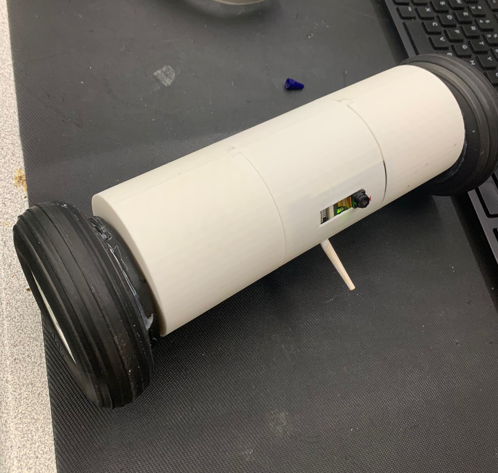

# Recon Drone Project README

## About The Project

The Recon Drone project, developed at Seneca Polytechnic by Adeesha Nirwan and Kwok Ching Chan, represents a significant advancement in the practical application of drone technology. Drawing inspiration from the video game Rainbow Six Siege, this project aims to adapt high-tech gaming concepts for real-world uses in surveillance, search and rescue, and infrastructure inspection.

**Why this project is a standout:**
- It emphasizes **practical application**, transforming virtual concepts into usable technology that enhances safety and efficiency.
- It reduces the repetitive task of starting from scratch by providing a **fully documented template** that others can adapt and improve upon.
- It embodies the DRY (Don't Repeat Yourself) principle, promoting efficient project setup and execution, which can be applied beyond just programming.

As project needs vary, this README will evolve, and contributions are welcome. You can suggest changes by forking this repo, creating a pull request, or opening an issue. Thanks to everyone who has contributed to refining this template!

[back to top](#recon-drone-project-readme)

## Built With

This project was developed using several key technologies:

- **Arduino IDE** - For programming the ESP-32 used in drone control.
- **ESP-32 CAM** - For real-time video feedback.
- **L298N Motor Driver** - To control the drone's dual wheels.

[back to top](#recon-drone-project-readme)

## Getting Started

This section guides you through getting a local copy of the Recon Drone project up and running on your own machine.

### Prerequisites

- Arduino IDE:

## Usage

The Recon Drone can be used in various scenarios such as:

- **Surveillance**: Monitor areas for safety and security.
- **Search and Rescue**: Assist in operations where time and safety are critical.
- **Infrastructure Inspection**: Evaluate structures in hard-to-reach places.

Here's how to start using the drone:

1. **Power up the drone** and ensure all connections are secure.
2. **Connect the drone to your smartphone** via Wi-Fi using the provided application.
3. **Use the app to navigate the drone** and start streaming video.
